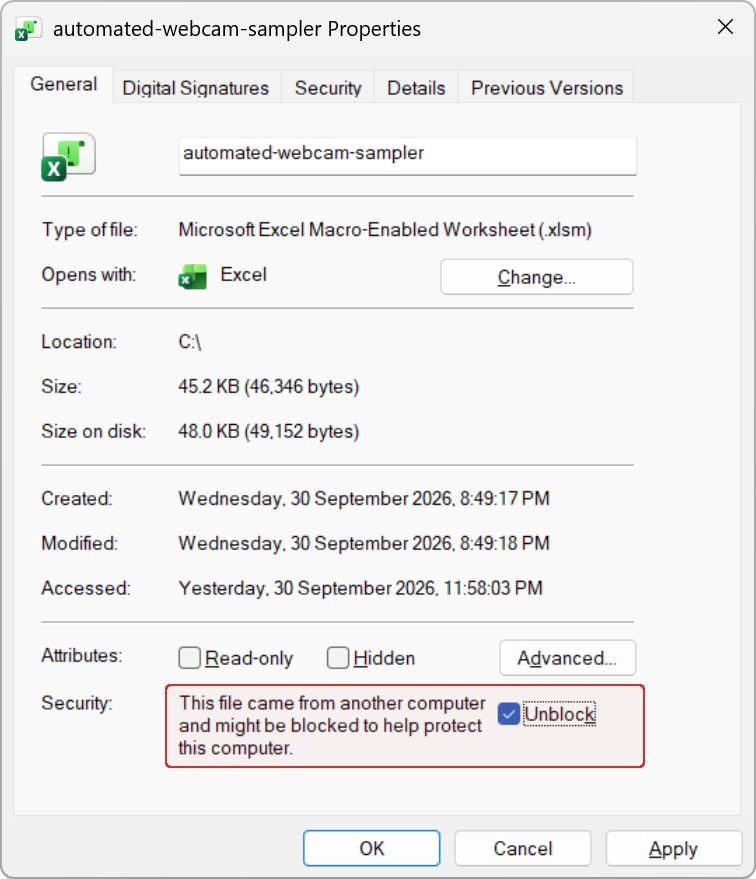

# Meteor candidate observations from automated weather camera sampling in VBA

 

This repository holds digital resources associated with the article
"Meteor candidate observations from automated weather camera sampling in VBA"
[[1](#references)]. That article discusses automated sampling of weather
webcam imaging for meteor detection. The sampling system was developed in
Excel, with the Visual Basic for Applications (VBA) scripting language. Though
introduced in the context of weather webcams, the system can be configured to
sample from any webcam with a publicly-accessible URL handle.

---

<figure>
  
  <figcaption>Figure 1. Sampling webcams managed by Airservices Australia on
  Norfolk Island.</figcaption>
</figure>

---

## Table of Contents

- [Key Files](#key-files)
- [Software Requirements](#software-requirements)
- [Quality Assurance](#quality-assurance)
- [Getting Started](#getting-started)
- [Acknowledgements](#acknowledgements)
- [References](#references)
- [Citation](#citation)
- [License](#license)

## Key Files

| File                                | Notes                                 |
| :---------------------------------- | :------------------------------------ |
| `src/automated-webcam-sampler.xlsm` | Macro-enabled Excel workbook.         |
| `src/webcam-sampler.bas`            | [VBA module](src/webcam-sampler.bas). |

The Excel workbook runs a custom automated webcam sampler. Its constituent
VBA module, `webcam-sampler.bas`, has also been provided as separate file for
easy code review outside Excel.

## Software Requirements

| Software                            | Notes                                                                                                                                                                    |
| :---------------------------------- | :----------------------------------------------------------------------------------------------------------------------------------------------------------------------- |
| Microsoft Excel &nbsp; &nbsp; | [Available here](https://www.microsoft.com/). Proprietary. &nbsp;&nbsp;&nbsp;Desktop app supported. &nbsp;&nbsp;&nbsp;Browser and mobile versions are unsupported. |
| Windows                             | [Available here](https://www.microsoft.com/). Proprietary.                                                                                                               |

## Quality Assurance

The webcam sampler has been tested in the following environment.

Windows Test Environment

 

| Type               | Component                 | Version                                                                                                 |
| :----------------- | :------------------------ | :------------------------------------------------------------------------------------------------------ |
| Platform           | Operating system          | Windows 11, 26H2 (OS Build 26300.9550)                                                                  |
| Software &nbsp; | Microsoft Excel &nbsp; | Microsoft Excel for Microsoft 365 MSO &nbsp;&nbsp;&nbsp;Version 2608, Build 16.0.20326.20072, 64-bit |

## Getting Started

The file `automated-webcam-sampler.xlsm` should be opened in Excel.

### Managing Macros

Macro-enabled content must be active in Excel to sample webcams.

Additionally, Windows may block the document's macros. To resolve this, right
click on the file to open Document Properties. Go to the General tab, Security
section and select the Unblock checkbox.

### Sampler Configuration

The webcam sampler has default settings for target webcams, sampling cadence,
sampling period, etc. These should be configured in VBA to meet your needs
prior to executing the sampler.

### Execution Options

There are two main ways to execute the sampler.

#### 1. Macro Button

The single Excel worksheet features a "Take Samples" button at the top left of
the worksheet that will execute the sampler.

#### 2. VBA Editor

The DownloadFileAPI function of the VBA code will execute webcam sampling. This
can be triggered from Excel's VBA editor. The VBA editor can be opened by
selecting Developer, Visual Basic from the Excel ribbon. If the Developer
option isn't visible in the Excel ribbon, it can be added by selecting File,
Options, Customize Ribbon from the Excel main menu. (Excel version 2608 menu
options.)

### Webcam Samples

Once webcam sampling is complete, downloaded files will be available on the
local file system at `C:\webcam-samples`.

## Acknowledgements

This work used publicly-accessible infrastructure managed by the Australian
government's Bureau of Meteorology and Airservices Australia.

Google Gemini [[2](#references)] was used as an assistive tool to refine VBA
code after initial human design, implementation and testing. Selected
AI-generated validation code was adapted and incorporated into the system
design. All other repository artifacts were created by the author.

## References

1. T. N. Stenborg, "Meteor candidate observations from automated weather camera
   sampling in VBA", in _Proc. International Meteor Conf._, U. Pajer,
   J. Rendtel, M. Gyssens and C. Verbeeck, Eds., 2020, pp. 189&ndash;190.\
   [View PDF](https://articles.adsabs.harvard.edu/pdf/2020pimo.conf..189S.pdf)
   &nbsp; [SciX](https://scixplorer.org/abs/2020pimo.conf..189S/abstract)

2. _Google Gemini_. (Large language model, September 2026 release). Google.
   [Online]. Available: [google.com](https://www.google.com/).

## Citation

Citation details are available by clicking **Cite this repository** in the
GitHub sidebar.

## License

This repository is licensed under the BSD-3-Clause license. Details are
available in the [LICENSE](./LICENSE) file.
